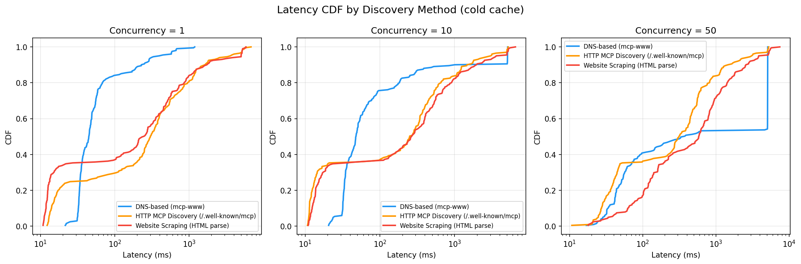
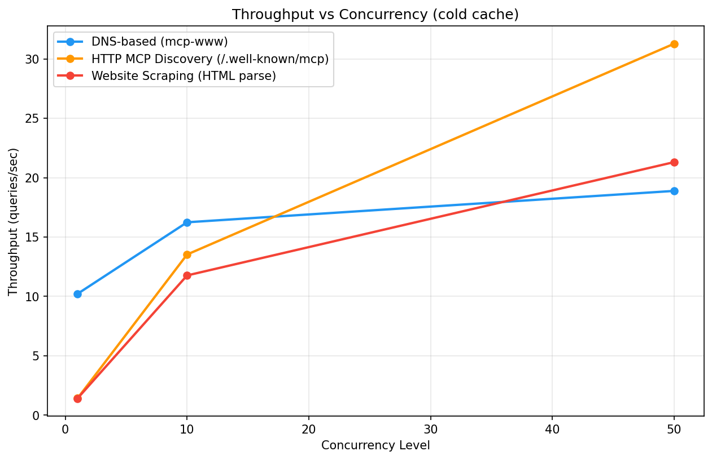
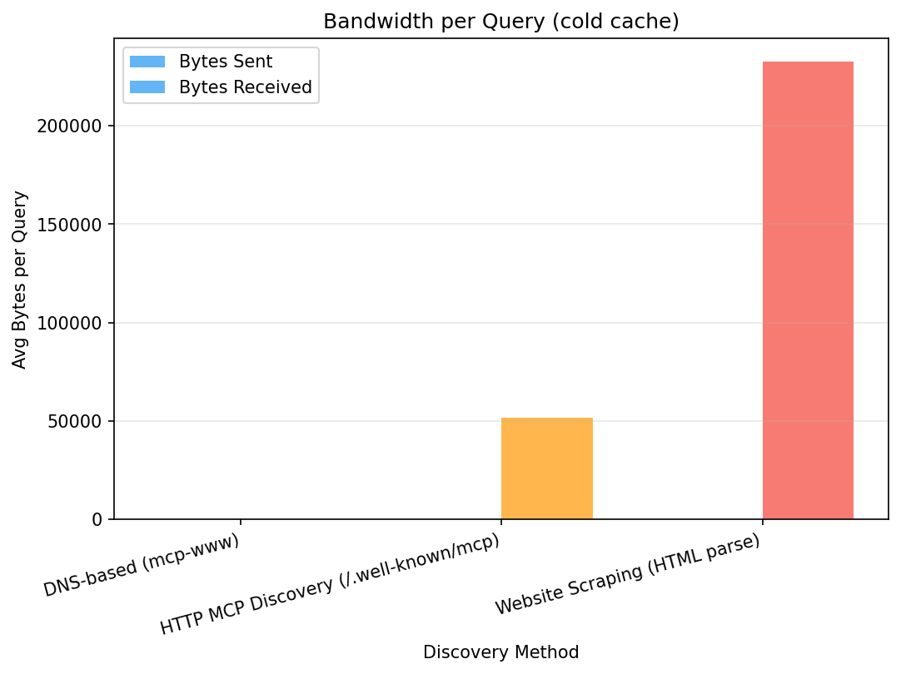
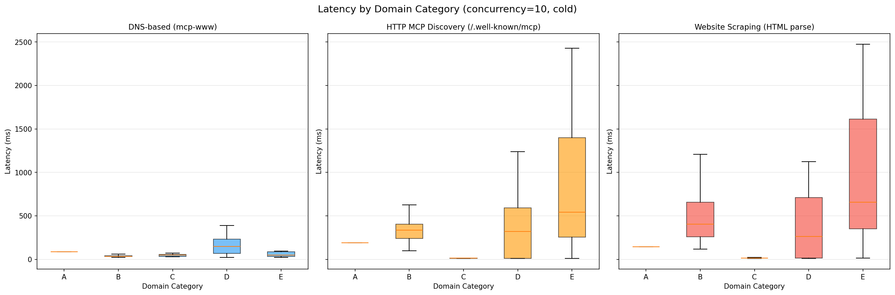

# MCP Discovery Benchmark Report

## Abstract

This experiment compares three approaches to discovering MCP (Model Context Protocol) servers across a set of domains: (1) DNS TXT record lookup via the mcp-www standard, (2) HTTP-based discovery via `/.well-known/mcp`, and (3) full website scraping with HTML pattern matching. We measure latency, throughput, bandwidth, and success rates across varying concurrency levels to determine which method scales best for large-scale MCP server indexing.

## Methodology

- **Platform:** win32

- **Python:** 3.12.10

- **Domains tested:** 201

- **Total queries:** 1809

- **Total runtime:** 381.6s

## Results Summary

### Latency by Method and Concurrency

| Method | Concurrency | Cache | Median (ms) | P95 (ms) | P99 (ms) | Success % | Throughput (q/s) |
|--------|-------------|-------|-------------|----------|----------|-----------|------------------|
| DNS-based (mcp-www) | c10 | cold | 48.0 | 5106.7 | 5122.5 | 90.0 | 1.7 |
| DNS-based (mcp-www) | c1 | cold | 44.8 | 397.6 | 682.4 | 100.0 | 10.2 |
| DNS-based (mcp-www) | c50 | cold | 377.2 | 5116.9 | 5120.4 | 53.2 | 0.4 |
| HTTP MCP Discovery (/.well-known/mcp) | c10 | cold | 250.1 | 3044.6 | 5114.5 | 55.2 | 1.7 |
| HTTP MCP Discovery (/.well-known/mcp) | c1 | cold | 302.2 | 3602.6 | 5603.0 | 55.2 | 1.4 |
| HTTP MCP Discovery (/.well-known/mcp) | c50 | cold | 314.8 | 3079.5 | 5221.9 | 55.2 | 1.5 |
| Website Scraping (HTML parse) | c10 | cold | 267.3 | 3613.5 | 5300.7 | 54.2 | 1.4 |
| Website Scraping (HTML parse) | c1 | cold | 249.9 | 5028.8 | 5270.8 | 54.2 | 1.4 |
| Website Scraping (HTML parse) | c50 | cold | 585.8 | 3844.9 | 5569.3 | 54.2 | 1.0 |

### Statistical Comparisons

| Comparison | Concurrency | Cache | Median A (ms) | Median B (ms) | Speedup | p-value | Significant | Effect Size |
|------------|-------------|-------|---------------|---------------|---------|---------|-------------|-------------|
| dns_mcp vs http_well_known | 1 | cold | 44.8 | 302.2 | 6.74x | 1.82e-12 | Yes | -0.718 |
| dns_mcp vs website_scrape | 1 | cold | 44.8 | 249.9 | 5.57x | 1.18e-04 | Yes | -0.655 |
| http_well_known vs website_scrape | 1 | cold | 302.2 | 249.9 | 0.83x | 1.49e-02 | No | 0.006 |
| dns_mcp vs http_well_known | 10 | cold | 48.0 | 250.1 | 5.21x | 4.15e-02 | No | -0.006 |
| dns_mcp vs website_scrape | 10 | cold | 48.0 | 267.3 | 5.57x | 2.57e-02 | No | -0.096 |
| http_well_known vs website_scrape | 10 | cold | 250.1 | 267.3 | 1.07x | 1.41e-01 | No | -0.108 |
| dns_mcp vs http_well_known | 50 | cold | 377.2 | 314.8 | 0.83x | 1.29e-05 | Yes | 0.934 |
| dns_mcp vs website_scrape | 50 | cold | 377.2 | 585.8 | 1.55x | 4.63e-01 | No | 0.717 |
| http_well_known vs website_scrape | 50 | cold | 314.8 | 585.8 | 1.86x | 1.67e-05 | Yes | -0.288 |

## Charts

### Latency Cdf Cold

### Throughput Vs Concurrency Cold

### Bandwidth Cold

### Latency By Category C10 Cold

## Discussion

The results should be interpreted considering:
- DNS queries use UDP (connectionless) while HTTP requires TCP+TLS setup
- Most domains do NOT have `_mcp` TXT records or `/.well-known/mcp` endpoints, so 'miss' latency dominates
- Website scraping downloads entire HTML pages, consuming significantly more bandwidth
- DNS resolver caching and HTTP connection pooling affect warm-cache performance
- Windows asyncio uses ProactorEventLoop which may affect UDP performance

## Reproducibility

Raw results are stored as JSONL files in `results/raw/`. System metrics are in `results/system_metrics/`. Re-run analysis with: `python scripts/analyze_results.py`
