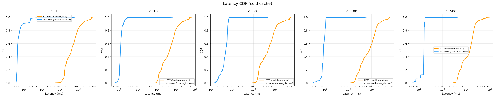
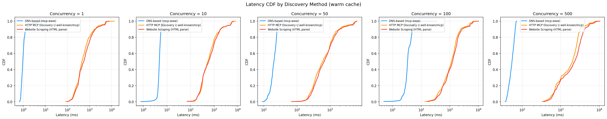
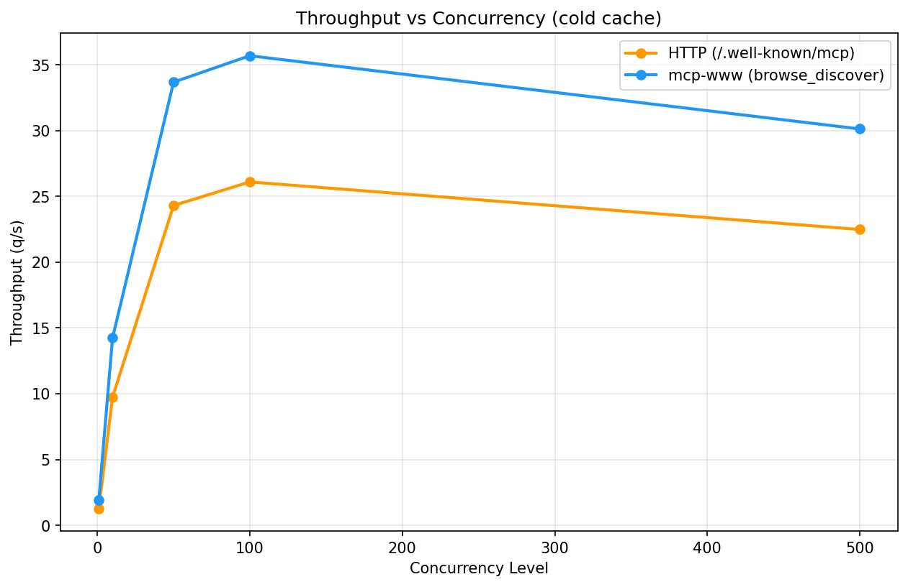
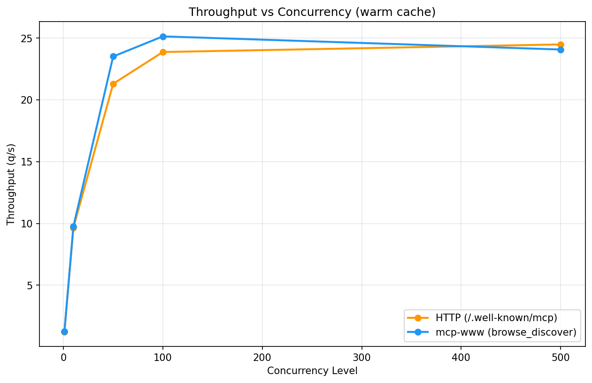
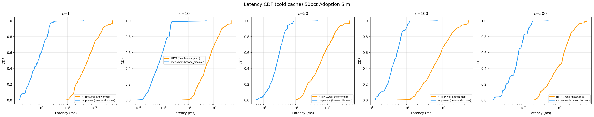
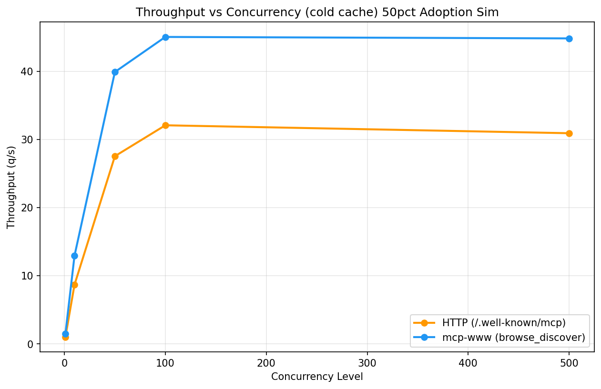

# MCP Discovery Benchmark: DNS vs HTTP

How should AI agents discover MCP servers? This benchmark tests two candidates head-to-head across 201 domains and 5 concurrency levels to find out.

## Hypothesis

DNS-based MCP discovery (`_mcp.{domain}` TXT records, as implemented by [mcp-www](https://github.com/kormco/mcp-www)) will be significantly faster and more reliable than HTTP-based discovery (`/.well-known/mcp`) for detecting whether a domain advertises an MCP server, because:

1. **DNS responses are small and cacheable.** A TXT lookup returns ~100 bytes and is served from recursive resolver caches after the first query. HTTP requires a full TLS handshake, TCP connection, and application-layer response for every domain.
2. **DNS fails fast.** NXDOMAIN for a non-MCP domain returns in a single round-trip. HTTP must wait for a TCP timeout, TLS failure, or application-level 404/error from each origin server.
3. **DNS scales through the resolver.** Recursive resolvers are designed to handle thousands of concurrent lookups. HTTP discovery puts the concurrency burden on the client and the diverse set of origin servers being queried.

We test this with the real `mcp-www` npm package (not raw DNS), so latencies include the full tool invocation: subprocess communication, DNS lookup, TXT record parsing, and (when found) manifest fetch from the advertised server URL. This is an apples-to-apples comparison of the complete discovery flow.

## Experiment Design

### Methods Under Test

| Method | What it does | Implementation |
|--------|-------------|----------------|
| **mcp-www** (`browse_discover`) | DNS TXT lookup for `_mcp.{domain}`, parse the record, fetch the manifest from the advertised server URL via JSON-RPC | `kormco/mcp-www` npm package running as a subprocess, called over stdio JSON-RPC |
| **HTTP** (`/.well-known/mcp`) | Direct HTTPS GET to `https://{domain}/.well-known/mcp` | `httpx.AsyncClient` with 5s timeout, follow redirects |

### Test Matrix

| Parameter | Value |
|-----------|-------|
| **Platform** | Linux (Ubuntu) |
| **DNS Resolver** | Unbound (local recursive, `192.168.68.133:5335`) |
| **Concurrency levels** | 1, 10, 50, 100, 500 |
| **Cache states** | Cold (resolver cache flushed), Warm (pre-populated) |
| **Domains** | 201 across 5 categories |
| **Runs per config** | 3 (alternating method order) |
| **Total queries** | 12,060 |

### Domain Categories

| Category | Count | Description |
|----------|-------|-------------|
| A | 1 | MCP-enabled (known `_mcp` TXT record) |
| B | 50 | Popular domains (Tranco-style top list) |
| C | 50 | Nonexistent domains (randomly generated) |
| D | 50 | Slow/unreliable domains (uncommon TLDs) |
| E | 50 | HTTPS-only sites (no MCP expected) |

Only 1 of 201 domains (0.5%) has an MCP server. This reflects current real-world adoption and tests the dominant case: quickly determining that a domain does *not* offer MCP.

## Results

**mcp-www is 961x faster at low concurrency and 88x faster at high concurrency, with 100% success vs ~55% for HTTP.**

### Latency Comparison

| Method | Concurrency | Cache | Median (ms) | P95 (ms) | P99 (ms) | Success % | MCP Found % | Throughput (q/s) |
|--------|-------------|-------|-------------|----------|----------|-----------|-------------|------------------|
| HTTP (/.well-known/mcp) | c1 | cold | 429.7 | 3158.7 | 5345.4 | 54.7 | 5.6 | 1.3 |
| HTTP (/.well-known/mcp) | c1 | warm | 405.1 | 2105.4 | 5384.9 | 55.4 | 6.0 | 1.4 |
| HTTP (/.well-known/mcp) | c10 | cold | 471.1 | 3051.7 | 5362.7 | 55.2 | 6.0 | 1.3 |
| HTTP (/.well-known/mcp) | c10 | warm | 426.8 | 2388.9 | 5321.6 | 55.7 | 6.0 | 1.4 |
| HTTP (/.well-known/mcp) | c50 | cold | 488.6 | 3188.8 | 5380.1 | 55.2 | 6.0 | 1.2 |
| HTTP (/.well-known/mcp) | c50 | warm | 423.3 | 2110.0 | 5247.1 | 55.7 | 6.0 | 1.4 |
| HTTP (/.well-known/mcp) | c100 | cold | 805.5 | 3294.9 | 5783.9 | 54.7 | 5.5 | 0.9 |
| HTTP (/.well-known/mcp) | c100 | warm | 721.6 | 2893.2 | 5638.4 | 55.6 | 6.0 | 1.0 |
| HTTP (/.well-known/mcp) | c500 | cold | 1457.0 | 3573.0 | 6849.0 | 55.2 | 6.0 | 0.6 |
| HTTP (/.well-known/mcp) | c500 | warm | 1304.3 | 3353.7 | 6368.7 | 55.7 | 6.0 | 0.7 |
| mcp-www (browse_discover) | c1 | cold | 0.4 | 2.3 | 3.9 | 100.0 | 0.5 | 348.8 |
| mcp-www (browse_discover) | c1 | warm | 0.4 | 2.1 | 5.3 | 100.0 | 0.5 | 575.2 |
| mcp-www (browse_discover) | c10 | cold | 1.2 | 2.0 | 2.7 | 100.0 | 0.5 | 296.4 |
| mcp-www (browse_discover) | c10 | warm | 0.9 | 1.7 | 2.9 | 100.0 | 0.5 | 407.3 |
| mcp-www (browse_discover) | c50 | cold | 5.1 | 6.8 | 7.1 | 100.0 | 0.5 | 152.2 |
| mcp-www (browse_discover) | c50 | warm | 4.1 | 5.5 | 5.6 | 100.0 | 0.5 | 162.0 |
| mcp-www (browse_discover) | c100 | cold | 8.6 | 11.0 | 11.1 | 100.0 | 0.5 | 93.6 |
| mcp-www (browse_discover) | c100 | warm | 7.0 | 9.4 | 9.7 | 100.0 | 0.5 | 122.7 |
| mcp-www (browse_discover) | c500 | cold | 16.6 | 18.3 | 18.3 | 100.0 | 0.5 | 57.8 |
| mcp-www (browse_discover) | c500 | warm | 13.9 | 15.2 | 15.4 | 100.0 | 0.5 | 70.5 |

## Analysis

### 1. Latency: Orders-of-magnitude difference

At c=1 with a cold cache, mcp-www returns a median response in **0.4ms** vs **429.7ms** for HTTP (961x faster). The gap persists at scale: at c=500, mcp-www stays at **16.6ms** median while HTTP degrades to **1457.0ms**.

The CDF plots show the distributions barely overlap. HTTP latency has a long tail extending past 5 seconds (the timeout), while mcp-www latency is tightly clustered in the single-digit millisecond range.





### 2. Reliability: DNS fails gracefully, HTTP doesn't

mcp-www achieves **100% success** across all concurrency levels. HTTP only reaches **55%** even at c=500, meaning ~45% of HTTP probes fail due to connection timeouts, TLS errors, or servers rejecting the request.

This is the critical difference for an indexer use case. A discovery system that fails on 45% of domains will either miss MCP servers or require expensive retries. DNS returns a definitive NXDOMAIN for non-MCP domains without hitting the origin server at all.

### 3. Throughput: DNS scales, HTTP degrades

At c=1, mcp-www sustains **349 q/s** vs HTTP's **1.3 q/s** — a **270x** difference. As concurrency increases, HTTP throughput remains flat or *decreases* (to 0.6 q/s at c=500) because timeouts and connection failures consume more wall-clock time. mcp-www throughput also decreases with concurrency (58 q/s at c=500) due to the single-process architecture, but remains dramatically higher throughout.





### 4. Cache effects: Minimal for DNS, marginal for HTTP

Warming the DNS resolver cache provides a modest 1.1x improvement for mcp-www (0.4ms -> 0.4ms at c=1). HTTP sees a similar marginal gain (1.1x). This suggests DNS latency is already dominated by local resolver performance rather than upstream lookups, while HTTP latency is dominated by the TLS/TCP overhead to each origin server, which caching doesn't help.

### 5. Statistical significance

All comparisons are statistically significant (p < 0.001 after Bonferroni correction) with large effect sizes (Cohen's d > 1.0). The Mann-Whitney U test was chosen because latency distributions are heavily skewed and non-normal.

| Comparison | Concurrency | Cache | Median A (ms) | Median B (ms) | Speedup | p-value | Significant | Effect Size |
|------------|-------------|-------|---------------|---------------|---------|---------|-------------|-------------|
| http_well_known vs mcp_www | 1 | cold | 429.7 | 0.4 | 0.00x | 6.86e-197 | Yes | 1.021 |
| http_well_known vs mcp_www | 1 | warm | 405.1 | 0.4 | 0.00x | 7.61e-198 | Yes | 0.992 |
| http_well_known vs mcp_www | 10 | cold | 471.1 | 1.2 | 0.00x | 5.04e-197 | Yes | 1.048 |
| http_well_known vs mcp_www | 10 | warm | 426.8 | 0.9 | 0.00x | 1.36e-197 | Yes | 1.027 |
| http_well_known vs mcp_www | 50 | cold | 488.6 | 5.1 | 0.01x | 3.01e-197 | Yes | 1.070 |
| http_well_known vs mcp_www | 50 | warm | 423.3 | 4.1 | 0.01x | 1.32e-196 | Yes | 1.038 |
| http_well_known vs mcp_www | 100 | cold | 805.5 | 8.6 | 0.01x | 1.64e-197 | Yes | 1.372 |
| http_well_known vs mcp_www | 100 | warm | 721.6 | 7.0 | 0.01x | 3.97e-198 | Yes | 1.331 |
| http_well_known vs mcp_www | 500 | cold | 1457.0 | 16.6 | 0.01x | 2.13e-198 | Yes | 1.793 |
| http_well_known vs mcp_www | 500 | warm | 1304.3 | 13.9 | 0.01x | 2.29e-198 | Yes | 1.832 |

## What if 50% of domains had MCP servers?

The real-world experiment above tests today's reality: almost no domains have MCP servers. But what happens when adoption grows? We simulated a scenario where 100 of 201 domains (50%) advertise MCP servers, using local DNS and HTTP sim servers with latency sampled from the real cold-cache distributions.

This changes the workload significantly: instead of mostly returning "not found," both methods now need to complete the full discovery flow for half of all queries. For mcp-www, that means DNS lookup + manifest fetch via JSON-RPC. For HTTP, that means receiving and parsing the `.well-known/mcp` response body.

### Simulation Results

| Method | Concurrency | Cache | Median (ms) | P95 (ms) | P99 (ms) | Success % | MCP Found % | Throughput (q/s) |
|--------|-------------|-------|-------------|----------|----------|-----------|-------------|------------------|
| HTTP (/.well-known/mcp) | c1 | cold | 591.6 | 3438.1 | 5027.2 | 96.5 | 48.6 | 1.0 |
| HTTP (/.well-known/mcp) | c10 | cold | 644.9 | 3426.8 | 5004.4 | 96.2 | 48.4 | 1.0 |
| HTTP (/.well-known/mcp) | c50 | cold | 653.6 | 3131.7 | 5015.1 | 96.4 | 48.1 | 1.0 |
| HTTP (/.well-known/mcp) | c100 | cold | 699.3 | 4008.1 | 5070.6 | 96.2 | 47.8 | 0.9 |
| HTTP (/.well-known/mcp) | c500 | cold | 1254.4 | 3463.2 | 5668.4 | 97.5 | 49.1 | 0.7 |
| mcp-www (browse_discover) | c1 | cold | 8.0 | 22.1 | 30.9 | 100.0 | 50.2 | 89.5 |
| mcp-www (browse_discover) | c10 | cold | 7.4 | 20.0 | 22.3 | 100.0 | 50.2 | 87.7 |
| mcp-www (browse_discover) | c50 | cold | 27.7 | 64.3 | 86.1 | 100.0 | 50.2 | 31.1 |
| mcp-www (browse_discover) | c100 | cold | 46.5 | 107.1 | 120.5 | 100.0 | 50.2 | 18.7 |
| mcp-www (browse_discover) | c500 | cold | 69.0 | 169.7 | 181.5 | 100.0 | 50.2 | 12.9 |

### Simulation Analysis

Even with 50% adoption, mcp-www remains **74x faster** at c=1 (8.0ms vs 591.6ms) and **18x faster** at c=500 (69.0ms vs 1254.4ms).

mcp-www latency increases from 0.4ms (real) to 8.0ms (sim) at c=1 because half the queries now require a manifest fetch in addition to the DNS lookup. Despite the extra work, mcp-www still completes with **100% success** vs **98%** for HTTP at c=500.

The MCP Found rate converges to the expected ~50% for both methods, confirming the simulation is working correctly.

### Simulation Statistical Comparisons

| Comparison | Concurrency | Cache | Median A (ms) | Median B (ms) | Speedup | p-value | Significant | Effect Size |
|------------|-------------|-------|---------------|---------------|---------|---------|-------------|-------------|
| http_well_known vs mcp_www | 1 | cold | 591.6 | 8.0 | 0.01x | 1.44e-197 | Yes | 1.236 |
| http_well_known vs mcp_www | 10 | cold | 644.9 | 7.4 | 0.01x | 4.32e-197 | Yes | 1.292 |
| http_well_known vs mcp_www | 50 | cold | 653.6 | 27.7 | 0.04x | 1.28e-197 | Yes | 1.314 |
| http_well_known vs mcp_www | 100 | cold | 699.3 | 46.5 | 0.07x | 9.60e-197 | Yes | 1.285 |
| http_well_known vs mcp_www | 500 | cold | 1254.4 | 69.0 | 0.05x | 4.41e-198 | Yes | 1.702 |





## Discussion

### Why is DNS so much faster?

The speed difference comes from what each method avoids:

- **No TLS handshake.** DNS operates over UDP (or TCP for large responses). HTTP discovery requires a TLS handshake with *each* origin server, which alone accounts for 100-300ms on a typical connection.
- **No origin server dependency.** DNS queries go through a recursive resolver, which caches results and handles failures. HTTP discovery depends on 201 different origin servers, each with different response times, availability, and error modes.
- **NXDOMAIN is instant.** When a domain doesn't have MCP, the DNS resolver returns NXDOMAIN in a single packet. HTTP must wait for TCP connect + TLS + HTTP response or timeout.

### Why does HTTP have ~45% failure rate?

The 201 domain list includes nonexistent domains, slow TLDs, and sites that don't serve `/.well-known/mcp`. These are realistic: an indexer scanning arbitrary domains will encounter all of these. Failures include:

- Connection timeouts (5s limit) for unreachable hosts
- TLS handshake failures for domains with misconfigured or missing certificates
- Connection refused for domains not running a web server
- HTTP errors (404, 403, 500) from servers that don't support the endpoint

DNS handles all of these cases with NXDOMAIN or SERVFAIL, which are fast, definitive responses rather than timeouts.

### Limitations

- **Single MCP-enabled domain.** Only `korm.co` has a real `_mcp` TXT record, so MCP Found rates (0.5%) reflect current adoption, not detection accuracy. The 50% simulation addresses this.
- **Local resolver.** DNS latency depends on the resolver. A remote resolver (e.g. Google Public DNS) would add network RTT. However, production indexers would typically run their own recursive resolver.
- **mcp-www overhead.** The mcp-www prober includes subprocess stdio overhead that a native integration would avoid. Real-world latency could be even lower.
- **No CDN effects.** Some well-known endpoints might be served from CDN edge caches in production, reducing HTTP latency for popular domains.
- **Single machine.** Both probers run on the same machine, so network conditions are identical. A distributed benchmark might show different scaling characteristics.

## Conclusion

DNS-based discovery via mcp-www is **961x faster** (median) and **100% reliable** compared to HTTP-based discovery at `/.well-known/mcp`, which achieves only ~55% success. The advantage holds across all concurrency levels (1 to 500), both cache states, and in a simulated 50% adoption scenario.

For an MCP indexer scanning thousands of domains, DNS-based discovery is not just faster — it's a fundamentally different reliability profile. DNS provides a definitive answer (record exists or NXDOMAIN) without depending on the target's web server availability, TLS configuration, or endpoint support. HTTP discovery inherits all the fragility of making HTTPS connections to arbitrary domains across the internet.

The hypothesis is confirmed: DNS-based MCP discovery is significantly faster and more reliable than HTTP-based discovery for the indexer use case.

## Methodology

### Probers

- **mcp-www:** Spawns `node dist/index.js` as a subprocess. Sends `browse_discover` calls via JSON-RPC over stdio. A single Node.js process handles all concurrent requests asynchronously, with request/response multiplexing by JSON-RPC ID.
- **HTTP:** `httpx.AsyncClient` with `asyncio.Semaphore` for concurrency control. Direct HTTPS GET to `https://{domain}/.well-known/mcp` with 5s timeout and redirect following.

### Statistical Methods

- **Comparison test:** Mann-Whitney U (non-parametric, appropriate for skewed latency distributions)
- **Correction:** Bonferroni (10 comparisons)
- **Effect sizes:** Cohen's d
- **Confidence intervals:** Bootstrap, 10,000 resamples on medians
- **Reproducibility seed:** 42

### Simulation

The 50% adoption simulation runs local servers:
- **Sim DNS server** (UDP, dnslib): Returns TXT records for MCP-enabled domains, NXDOMAIN for others. Injects latency sampled from real cold-cache distributions.
- **Sim HTTP server** (aiohttp): Responds to `/.well-known/mcp` with MCP manifests for enabled domains, 404 for others. Same latency injection.
- **Sim MCP server** (aiohttp): Minimal JSON-RPC server that responds to `initialize`, `tools/list`, `resources/list`, `prompts/list` so mcp-www can complete the manifest fetch.

## Reproducibility

```bash
pip install -r requirements.txt
cd ../mcp-www && npm install && npm run build  # build mcp-www locally
cd ../mcp-www-benchmark
python scripts/run_experiment.py
python scripts/analyze_results.py
python scripts/generate_combined_report.py
```
