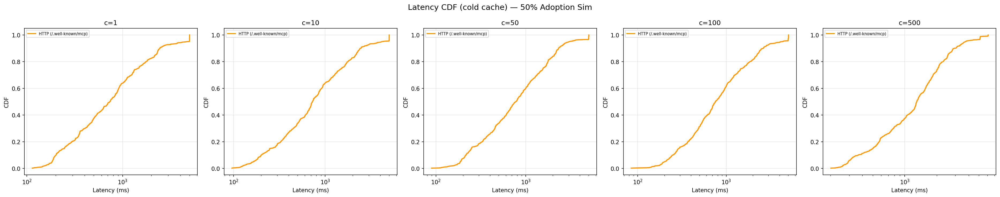
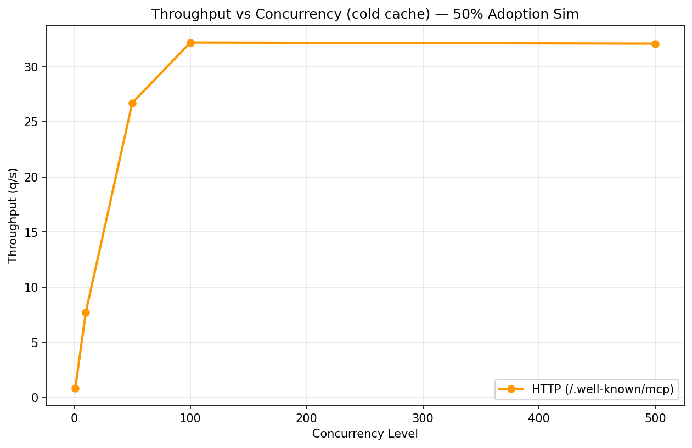

# MCP Discovery Benchmark Report

This benchmark compares two approaches to discovering MCP (Model Context Protocol) servers at scale:
- **mcp-www** (`browse_discover`): DNS TXT lookup for `_mcp.{domain}` + manifest fetch from the advertised server URL
- **HTTP** (`/.well-known/mcp`): Direct HTTPS GET to a well-known endpoint

mcp-www is tested as the actual npm package running as a subprocess, called via JSON-RPC over stdio. This measures the real end-to-end tool invocation, not raw DNS.

## Setup

| Parameter | Value |
|-----------|-------|
| **Platform** | Linux (Ubuntu) |
| **DNS Resolver** | Unbound on Synology NAS (`192.168.68.133:5335`) |
| **Methods** | mcp-www (browse_discover), HTTP (/.well-known/mcp) |
| **Concurrency** | 1, 10, 50, 100, 500 |
| **Cache States** | Cold, Warm |
| **Total Queries** | 12060 |
| **Domains** | 201 across 5 categories |
| **Runs/Config** | 3 |
| **mcp-www** | Local build from `kormco/mcp-www` (browse_discover tool) |

## Results

### Latency Summary

| Method | Concurrency | Cache | Median (ms) | P95 (ms) | P99 (ms) | Success % | MCP Found % | Throughput (q/s) |
|--------|-------------|-------|-------------|----------|----------|-----------|-------------|------------------|
| HTTP (/.well-known/mcp) | c1 | cold | 429.7 | 3158.7 | 5345.4 | 54.7 | 5.6 | 1.3 |
| HTTP (/.well-known/mcp) | c1 | warm | 405.1 | 2105.4 | 5384.9 | 55.4 | 6.0 | 1.4 |
| HTTP (/.well-known/mcp) | c10 | cold | 471.1 | 3051.7 | 5362.7 | 55.2 | 6.0 | 1.3 |
| HTTP (/.well-known/mcp) | c10 | warm | 426.8 | 2388.9 | 5321.6 | 55.7 | 6.0 | 1.4 |
| HTTP (/.well-known/mcp) | c50 | cold | 488.6 | 3188.8 | 5380.1 | 55.2 | 6.0 | 1.2 |
| HTTP (/.well-known/mcp) | c50 | warm | 423.3 | 2110.0 | 5247.1 | 55.7 | 6.0 | 1.4 |
| HTTP (/.well-known/mcp) | c100 | cold | 805.5 | 3294.9 | 5783.9 | 54.7 | 5.5 | 0.9 |
| HTTP (/.well-known/mcp) | c100 | warm | 721.6 | 2893.2 | 5638.4 | 55.6 | 6.0 | 1.0 |
| HTTP (/.well-known/mcp) | c500 | cold | 1457.0 | 3573.0 | 6849.0 | 55.2 | 6.0 | 0.6 |
| HTTP (/.well-known/mcp) | c500 | warm | 1304.3 | 3353.7 | 6368.7 | 55.7 | 6.0 | 0.7 |
| mcp-www (browse_discover) | c1 | cold | 0.4 | 2.3 | 3.9 | 100.0 | 0.5 | 348.8 |
| mcp-www (browse_discover) | c1 | warm | 0.4 | 2.1 | 5.3 | 100.0 | 0.5 | 575.2 |
| mcp-www (browse_discover) | c10 | cold | 1.2 | 2.0 | 2.7 | 100.0 | 0.5 | 296.4 |
| mcp-www (browse_discover) | c10 | warm | 0.9 | 1.7 | 2.9 | 100.0 | 0.5 | 407.3 |
| mcp-www (browse_discover) | c50 | cold | 5.1 | 6.8 | 7.1 | 100.0 | 0.5 | 152.2 |
| mcp-www (browse_discover) | c50 | warm | 4.1 | 5.5 | 5.6 | 100.0 | 0.5 | 162.0 |
| mcp-www (browse_discover) | c100 | cold | 8.6 | 11.0 | 11.1 | 100.0 | 0.5 | 93.6 |
| mcp-www (browse_discover) | c100 | warm | 7.0 | 9.4 | 9.7 | 100.0 | 0.5 | 122.7 |
| mcp-www (browse_discover) | c500 | cold | 16.6 | 18.3 | 18.3 | 100.0 | 0.5 | 57.8 |
| mcp-www (browse_discover) | c500 | warm | 13.9 | 15.2 | 15.4 | 100.0 | 0.5 | 70.5 |

### Statistical Comparisons

| Comparison | Concurrency | Cache | Median A (ms) | Median B (ms) | Speedup | p-value | Significant | Effect Size |
|------------|-------------|-------|---------------|---------------|---------|---------|-------------|-------------|
| http_well_known vs mcp_www | 1 | cold | 429.7 | 0.4 | 0.00x | 6.86e-197 | Yes | 1.021 |
| http_well_known vs mcp_www | 1 | warm | 405.1 | 0.4 | 0.00x | 7.61e-198 | Yes | 0.992 |
| http_well_known vs mcp_www | 10 | cold | 471.1 | 1.2 | 0.00x | 5.04e-197 | Yes | 1.048 |
| http_well_known vs mcp_www | 10 | warm | 426.8 | 0.9 | 0.00x | 1.36e-197 | Yes | 1.027 |
| http_well_known vs mcp_www | 50 | cold | 488.6 | 5.1 | 0.01x | 3.01e-197 | Yes | 1.070 |
| http_well_known vs mcp_www | 50 | warm | 423.3 | 4.1 | 0.01x | 1.32e-196 | Yes | 1.038 |
| http_well_known vs mcp_www | 100 | cold | 805.5 | 8.6 | 0.01x | 1.64e-197 | Yes | 1.372 |
| http_well_known vs mcp_www | 100 | warm | 721.6 | 7.0 | 0.01x | 3.97e-198 | Yes | 1.331 |
| http_well_known vs mcp_www | 500 | cold | 1457.0 | 16.6 | 0.01x | 2.13e-198 | Yes | 1.793 |
| http_well_known vs mcp_www | 500 | warm | 1304.3 | 13.9 | 0.01x | 2.29e-198 | Yes | 1.832 |

### Charts

#### Latency Cdf Cold


#### Throughput Cold


#### Latency Cdf Warm


#### Throughput Warm


## Key Findings

- **At c=1 (cold):** mcp-www 0.4ms vs HTTP 429.7ms (961x)
- **At c=500 (cold):** mcp-www 16.6ms vs HTTP 1457.0ms (88x)
- **Success at c=500 (cold):** mcp-www 100% vs HTTP 55%

## 50% Adoption Simulation

Simulated 50% MCP adoption (100/201 domains have MCP servers). Uses local DNS and HTTP sim servers with latency injected from real cold-cache distributions. mcp-www runs against the sim DNS server.

### Simulation Results

| Method | Concurrency | Cache | Median (ms) | P95 (ms) | P99 (ms) | Success % | MCP Found % | Throughput (q/s) |
|--------|-------------|-------|-------------|----------|----------|-----------|-------------|------------------|
| HTTP (/.well-known/mcp) | c1 | cold | 735.1 | 4677.0 | 5008.9 | 95.0 | 47.6 | 0.9 |
| HTTP (/.well-known/mcp) | c10 | cold | 728.4 | 4146.6 | 5004.9 | 95.4 | 48.3 | 0.9 |
| HTTP (/.well-known/mcp) | c50 | cold | 779.3 | 3042.3 | 5027.5 | 96.5 | 48.6 | 0.9 |
| HTTP (/.well-known/mcp) | c100 | cold | 756.0 | 4242.5 | 5056.6 | 95.5 | 47.6 | 0.8 |
| HTTP (/.well-known/mcp) | c500 | cold | 1302.6 | 3750.6 | 5397.4 | 96.7 | 48.4 | 0.6 |

### Simulation Statistical Comparisons

| Comparison | Concurrency | Cache | Median A (ms) | Median B (ms) | Speedup | p-value | Significant | Effect Size |
|------------|-------------|-------|---------------|---------------|---------|---------|-------------|-------------|


### Simulation Charts

#### Latency Cdf Cold — 50% Adoption Sim



#### Throughput Cold — 50% Adoption Sim



## Methodology

- **mcp-www prober:** Spawns `node dist/index.js` subprocess, sends `browse_discover` calls via JSON-RPC over stdio. Single process handles all concurrent requests.
- **HTTP prober:** Direct `httpx.AsyncClient` GET to `https://{domain}/.well-known/mcp`
- **Statistical tests:** Mann-Whitney U (non-parametric) with Bonferroni correction
- **Effect sizes:** Cohen's d and rank-biserial correlation
- **Confidence intervals:** Bootstrap (10,000 resamples) on medians
- **Domain list:** 201 domains across 5 categories (MCP-enabled, popular, nonexistent, slow, HTTPS-only)
- **Reproducibility seed:** 42

## Reproducibility

```bash
pip install -r requirements.txt
cd ../mcp-www && npm install && npm run build  # build mcp-www locally
cd ../mcp-www-benchmark
python scripts/run_experiment.py
python scripts/analyze_results.py
python scripts/generate_combined_report.py
```
