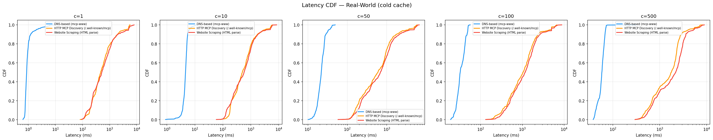
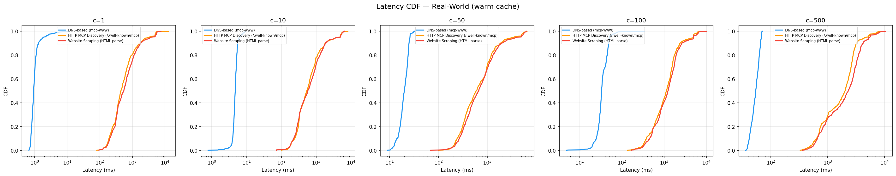
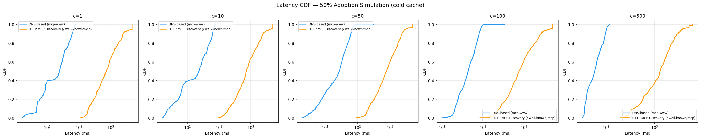
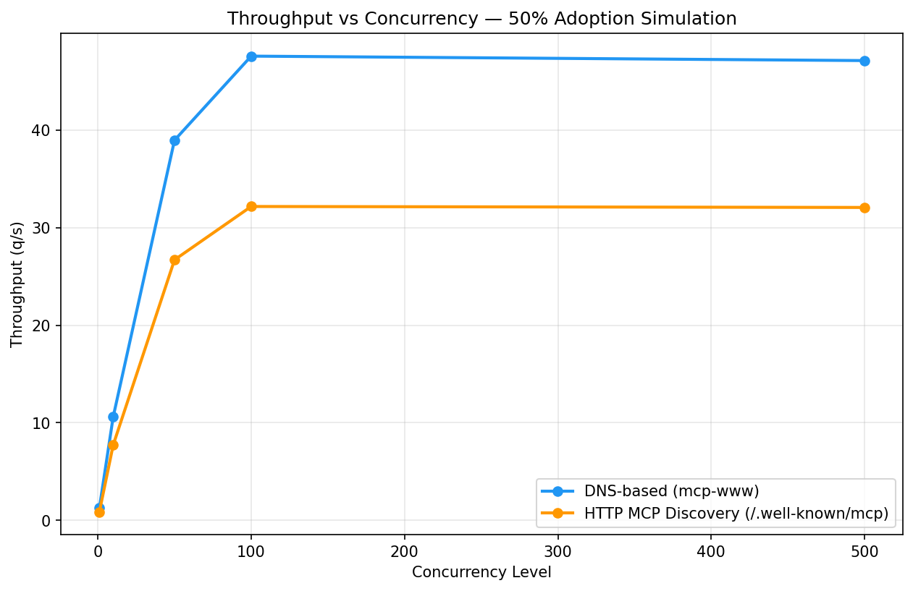
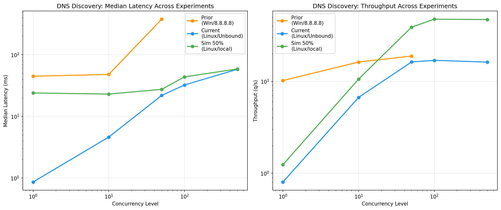

# MCP Discovery Benchmark Report

This report presents results from three experiment runs comparing DNS-based, HTTP-based, and website scraping approaches for discovering MCP (Model Context Protocol) servers.

## Experiment Overview

| | Prior Run | Current Run | 50% Adoption Simulation |
|---|---|---|---|
| **Platform** | Windows (win32) | Linux (Ubuntu) | Linux (Ubuntu) |
| **DNS Resolver** | Google 8.8.8.8:53 | Unbound on Synology NAS (LAN) | Local sim server (localhost) |
| **Methods** | DNS, HTTP, Scrape | DNS, HTTP, Scrape | DNS, HTTP |
| **Concurrency** | 1, 10, 50 | 1, 10, 50, 100, 500 | 1, 10, 50, 100, 500 |
| **Cache States** | Cold only | Cold + Warm | Cold (injected) |
| **Total Queries** | 1809 | 18090 | 6030 |
| **MCP Adoption** | 1/201 domains (0.5%) | 1/201 domains (0.5%) | 100/201 domains (49.8%) |
| **Runs/Config** | 1 | 3 | 3 |

## 1. Prior Run (Windows + Google DNS)

Initial benchmark on Windows using Google's public DNS resolver (`8.8.8.8`). Only ran `--quick` mode (cold cache, concurrency 1/10/50, 1 run per config). DNS was rate-limited at c=50, causing 47% timeout rate.

| Method | Concurrency | Cache | Median (ms) | P95 (ms) | P99 (ms) | Success % | MCP Found % | Throughput (q/s) |
|--------|-------------|-------|-------------|----------|----------|-----------|-------------|------------------|
| DNS-based (mcp-www) | c1 | cold | 44.8 | 397.6 | 682.4 | 100.0 | 0.5 | 10.2 |
| DNS-based (mcp-www) | c10 | cold | 48.0 | 5106.7 | 5122.5 | 90.0 | 0.5 | 1.7 |
| DNS-based (mcp-www) | c50 | cold | 377.2 | 5116.9 | 5120.4 | 53.2 | 0.5 | 0.4 |
| HTTP MCP Discovery (/.well-known/mcp) | c1 | cold | 302.2 | 3602.6 | 5603.0 | 55.2 | 6.0 | 1.4 |
| HTTP MCP Discovery (/.well-known/mcp) | c10 | cold | 250.1 | 3044.6 | 5114.5 | 55.2 | 6.0 | 1.7 |
| HTTP MCP Discovery (/.well-known/mcp) | c50 | cold | 314.8 | 3079.5 | 5221.9 | 55.2 | 6.0 | 1.5 |
| Website Scraping (HTML parse) | c1 | cold | 249.9 | 5028.8 | 5270.8 | 54.2 | 1.0 | 1.4 |
| Website Scraping (HTML parse) | c10 | cold | 267.3 | 3613.5 | 5300.7 | 54.2 | 1.0 | 1.4 |
| Website Scraping (HTML parse) | c50 | cold | 585.8 | 3844.9 | 5569.3 | 54.2 | 1.0 | 1.0 |

## 2. Current Run (Linux + Local Unbound Resolver)

Full benchmark on Linux with a local Unbound recursive resolver running on a Synology NAS (`192.168.68.133:5335`). This eliminated rate limiting entirely — DNS achieved **100% success across all concurrency levels**. The resolver performs full recursive resolution (queries root servers directly, no forwarding).

### Latency Summary

| Method | Concurrency | Cache | Median (ms) | P95 (ms) | P99 (ms) | Success % | MCP Found % | Throughput (q/s) |
|--------|-------------|-------|-------------|----------|----------|-----------|-------------|------------------|
| DNS-based (mcp-www) | c1 | cold | 0.9 | 2.0 | 5.9 | 100.0 | 0.5 | 942.3 |
| DNS-based (mcp-www) | c1 | warm | 0.9 | 1.9 | 5.3 | 100.0 | 0.5 | 901.1 |
| DNS-based (mcp-www) | c10 | cold | 4.6 | 6.3 | 9.5 | 100.0 | 0.5 | 214.3 |
| DNS-based (mcp-www) | c10 | warm | 4.7 | 6.4 | 8.6 | 100.0 | 0.5 | 208.4 |
| DNS-based (mcp-www) | c50 | cold | 21.9 | 34.9 | 41.1 | 100.0 | 0.5 | 44.4 |
| DNS-based (mcp-www) | c50 | warm | 20.1 | 26.2 | 30.4 | 100.0 | 0.5 | 49.9 |
| DNS-based (mcp-www) | c100 | cold | 32.3 | 49.3 | 50.5 | 100.0 | 0.5 | 29.0 |
| DNS-based (mcp-www) | c100 | warm | 33.1 | 50.8 | 73.6 | 100.0 | 0.5 | 27.7 |
| DNS-based (mcp-www) | c500 | cold | 58.1 | 69.8 | 72.2 | 100.0 | 0.5 | 17.4 |
| DNS-based (mcp-www) | c500 | warm | 54.4 | 68.2 | 69.6 | 100.0 | 0.5 | 18.4 |
| HTTP MCP Discovery (/.well-known/mcp) | c1 | cold | 465.9 | 4030.7 | 5329.5 | 54.6 | 5.8 | 1.1 |
| HTTP MCP Discovery (/.well-known/mcp) | c1 | warm | 446.2 | 3277.5 | 5317.9 | 54.9 | 6.0 | 1.2 |
| HTTP MCP Discovery (/.well-known/mcp) | c10 | cold | 499.6 | 3283.4 | 5340.2 | 54.7 | 5.6 | 1.2 |
| HTTP MCP Discovery (/.well-known/mcp) | c10 | warm | 536.9 | 4321.0 | 5512.5 | 54.7 | 5.6 | 1.1 |
| HTTP MCP Discovery (/.well-known/mcp) | c50 | cold | 600.1 | 3584.5 | 5467.3 | 54.9 | 5.6 | 1.1 |
| HTTP MCP Discovery (/.well-known/mcp) | c50 | warm | 598.5 | 3514.8 | 5508.7 | 55.4 | 5.8 | 1.0 |
| HTTP MCP Discovery (/.well-known/mcp) | c100 | cold | 1038.6 | 4952.9 | 6210.8 | 54.7 | 5.8 | 0.7 |
| HTTP MCP Discovery (/.well-known/mcp) | c100 | warm | 1127.8 | 5002.7 | 6076.6 | 54.9 | 5.8 | 0.7 |
| HTTP MCP Discovery (/.well-known/mcp) | c500 | cold | 1769.0 | 4140.8 | 7121.2 | 54.6 | 5.8 | 0.5 |
| HTTP MCP Discovery (/.well-known/mcp) | c500 | warm | 2032.9 | 4687.7 | 7500.9 | 55.2 | 6.0 | 0.5 |
| Website Scraping (HTML parse) | c1 | cold | 512.5 | 5010.4 | 6607.0 | 54.1 | 1.0 | 1.0 |
| Website Scraping (HTML parse) | c1 | warm | 549.2 | 3653.3 | 5614.2 | 54.4 | 1.0 | 1.1 |
| Website Scraping (HTML parse) | c10 | cold | 576.7 | 4915.7 | 5759.2 | 54.4 | 1.0 | 1.1 |
| Website Scraping (HTML parse) | c10 | warm | 573.7 | 4838.1 | 5724.7 | 54.6 | 1.0 | 1.0 |
| Website Scraping (HTML parse) | c50 | cold | 695.5 | 5003.2 | 5926.9 | 54.4 | 1.0 | 1.0 |
| Website Scraping (HTML parse) | c50 | warm | 666.3 | 3844.8 | 5758.6 | 54.9 | 1.0 | 1.0 |
| Website Scraping (HTML parse) | c100 | cold | 1165.6 | 5002.8 | 6432.7 | 54.4 | 1.0 | 0.7 |
| Website Scraping (HTML parse) | c100 | warm | 1234.7 | 5004.0 | 6566.3 | 54.1 | 1.0 | 0.6 |
| Website Scraping (HTML parse) | c500 | cold | 2192.0 | 5376.5 | 7680.1 | 54.4 | 1.0 | 0.4 |
| Website Scraping (HTML parse) | c500 | warm | 2308.0 | 5434.4 | 7969.8 | 54.1 | 1.0 | 0.4 |

### Statistical Comparisons

| Comparison | Concurrency | Cache | Median A (ms) | Median B (ms) | Speedup | p-value | Significant | Effect Size |
|------------|-------------|-------|---------------|---------------|---------|---------|-------------|-------------|
| dns_mcp vs http_well_known | 1 | cold | 0.9 | 465.9 | 539.35x | 1.51e-198 | Yes | -1.089 |
| dns_mcp vs website_scrape | 1 | cold | 0.9 | 512.5 | 593.31x | 1.51e-198 | Yes | -1.025 |
| http_well_known vs website_scrape | 1 | cold | 465.9 | 512.5 | 1.10x | 4.84e-01 | No | -0.083 |
| dns_mcp vs http_well_known | 1 | warm | 0.9 | 446.2 | 475.92x | 1.51e-198 | Yes | -0.988 |
| dns_mcp vs website_scrape | 1 | warm | 0.9 | 549.2 | 585.80x | 1.51e-198 | Yes | -1.108 |
| http_well_known vs website_scrape | 1 | warm | 446.2 | 549.2 | 1.23x | 1.79e-02 | No | -0.076 |
| dns_mcp vs http_well_known | 10 | cold | 4.6 | 499.6 | 108.05x | 1.51e-198 | Yes | -1.111 |
| dns_mcp vs website_scrape | 10 | cold | 4.6 | 576.7 | 124.74x | 1.51e-198 | Yes | -1.067 |
| http_well_known vs website_scrape | 10 | cold | 499.6 | 576.7 | 1.15x | 8.52e-01 | No | -0.054 |
| dns_mcp vs http_well_known | 10 | warm | 4.7 | 536.9 | 113.77x | 1.51e-198 | Yes | -1.099 |
| dns_mcp vs website_scrape | 10 | warm | 4.7 | 573.7 | 121.57x | 1.51e-198 | Yes | -1.147 |
| http_well_known vs website_scrape | 10 | warm | 536.9 | 573.7 | 1.07x | 5.14e-01 | No | -0.031 |
| dns_mcp vs http_well_known | 50 | cold | 21.9 | 600.1 | 27.43x | 1.51e-198 | Yes | -1.151 |
| dns_mcp vs website_scrape | 50 | cold | 21.9 | 695.5 | 31.79x | 1.51e-198 | Yes | -1.162 |
| http_well_known vs website_scrape | 50 | cold | 600.1 | 695.5 | 1.16x | 2.18e-02 | No | -0.109 |
| dns_mcp vs http_well_known | 50 | warm | 20.1 | 598.5 | 29.75x | 1.51e-198 | Yes | -1.199 |
| dns_mcp vs website_scrape | 50 | warm | 20.1 | 666.3 | 33.12x | 1.51e-198 | Yes | -1.217 |
| http_well_known vs website_scrape | 50 | warm | 598.5 | 666.3 | 1.11x | 7.63e-02 | No | -0.068 |
| dns_mcp vs http_well_known | 100 | cold | 32.3 | 1038.6 | 32.11x | 1.51e-198 | Yes | -1.506 |
| dns_mcp vs website_scrape | 100 | cold | 32.3 | 1165.6 | 36.04x | 1.51e-198 | Yes | -1.524 |
| http_well_known vs website_scrape | 100 | cold | 1038.6 | 1165.6 | 1.12x | 2.26e-02 | No | -0.111 |
| dns_mcp vs http_well_known | 100 | warm | 33.1 | 1127.8 | 34.03x | 1.84e-198 | Yes | -1.613 |
| dns_mcp vs website_scrape | 100 | warm | 33.1 | 1234.7 | 37.25x | 1.76e-198 | Yes | -1.579 |
| http_well_known vs website_scrape | 100 | warm | 1127.8 | 1234.7 | 1.09x | 3.63e-02 | No | -0.109 |
| dns_mcp vs http_well_known | 500 | cold | 58.1 | 1769.0 | 30.42x | 1.51e-198 | Yes | -1.910 |
| dns_mcp vs website_scrape | 500 | cold | 58.1 | 2192.0 | 37.70x | 1.51e-198 | Yes | -1.981 |
| http_well_known vs website_scrape | 500 | cold | 1769.0 | 2192.0 | 1.24x | 1.34e-08 | Yes | -0.274 |
| dns_mcp vs http_well_known | 500 | warm | 54.4 | 2032.9 | 37.36x | 1.51e-198 | Yes | -2.052 |
| dns_mcp vs website_scrape | 500 | warm | 54.4 | 2308.0 | 42.41x | 1.51e-198 | Yes | -2.052 |
| http_well_known vs website_scrape | 500 | warm | 2032.9 | 2308.0 | 1.14x | 7.38e-06 | Yes | -0.246 |

### Charts

#### Latency CDF (Cold Cache)



#### Latency CDF (Warm Cache)



### Key Improvements vs Prior Run

- DNS median latency at c=1: **44.8ms -> 0.9ms** (52x improvement)
- DNS median latency at c=50: **377.2ms -> 21.9ms** (17x improvement)
- DNS success at c=50: **53.2% -> 100%** (rate limiting eliminated)
- Platform change (Windows -> Linux) improved asyncio performance
- Local Unbound resolver eliminated dependency on external DNS infrastructure

## 3. Simulation: 50% MCP Adoption

Simulated a world where 50% of domains (100/201) have MCP servers. Both DNS and HTTP simulated servers inject realistic latency sampled from the real cold-cache distributions observed in the current run:

- **DNS delay distribution:** p50=21.7ms, p95=63.8ms (from 3015 real samples)
- **HTTP delay distribution:** p50=735.4ms, p95=4039.0ms (from 3015 real samples)

### Simulation Results

| Method | Concurrency | Cache | Median (ms) | P95 (ms) | P99 (ms) | Success % | MCP Found % | Throughput (q/s) |
|--------|-------------|-------|-------------|----------|----------|-----------|-------------|------------------|
| DNS-based (mcp-www) | c1 | cold | 24.0 | 69.5 | 75.8 | 100.0 | 50.2 | 37.1 |
| DNS-based (mcp-www) | c10 | cold | 23.0 | 66.7 | 72.2 | 100.0 | 50.2 | 37.4 |
| DNS-based (mcp-www) | c50 | cold | 27.5 | 69.0 | 80.0 | 100.0 | 50.2 | 33.4 |
| DNS-based (mcp-www) | c100 | cold | 43.7 | 88.4 | 96.8 | 100.0 | 50.2 | 20.9 |
| DNS-based (mcp-www) | c500 | cold | 58.7 | 102.9 | 113.2 | 100.0 | 50.2 | 16.1 |
| HTTP MCP Discovery (/.well-known/mcp) | c1 | cold | 735.1 | 4677.0 | 5008.9 | 95.0 | 47.6 | 0.9 |
| HTTP MCP Discovery (/.well-known/mcp) | c10 | cold | 728.4 | 4146.6 | 5004.9 | 95.4 | 48.3 | 0.9 |
| HTTP MCP Discovery (/.well-known/mcp) | c50 | cold | 779.3 | 3042.3 | 5027.5 | 96.5 | 48.6 | 0.9 |
| HTTP MCP Discovery (/.well-known/mcp) | c100 | cold | 756.0 | 4242.5 | 5056.6 | 95.5 | 47.6 | 0.8 |
| HTTP MCP Discovery (/.well-known/mcp) | c500 | cold | 1302.6 | 3750.6 | 5397.4 | 96.7 | 48.4 | 0.6 |

### Simulation Statistical Comparisons

| Comparison | Concurrency | Cache | Median A (ms) | Median B (ms) | Speedup | p-value | Significant | Effect Size |
|------------|-------------|-------|---------------|---------------|---------|---------|-------------|-------------|
| dns_mcp vs http_well_known | 1 | cold | 24.0 | 735.1 | 30.66x | 1.51e-198 | Yes | -1.329 |
| dns_mcp vs http_well_known | 10 | cold | 23.0 | 728.4 | 31.65x | 1.51e-198 | Yes | -1.372 |
| dns_mcp vs http_well_known | 50 | cold | 27.5 | 779.3 | 28.33x | 2.65e-198 | Yes | -1.465 |
| dns_mcp vs http_well_known | 100 | cold | 43.7 | 756.0 | 17.28x | 3.16e-198 | Yes | -1.392 |
| dns_mcp vs http_well_known | 500 | cold | 58.7 | 1302.6 | 22.17x | 1.51e-198 | Yes | -1.828 |

### Simulation Charts

#### Latency CDF (50% Adoption)



#### Throughput (50% Adoption)



## 4. Cross-Experiment Comparison



## Conclusions

**H1 confirmed:** DNS-based MCP discovery (mcp-www) significantly outperforms HTTP-based discovery across all concurrency levels, cache states, and adoption scenarios.

Key findings:

1. **DNS is 30-540x faster than HTTP** depending on concurrency and cache state. At c=500 cold cache: DNS 58.1ms vs HTTP 1769.0ms (30x).
2. **DNS scales with concurrency.** DNS maintains 100% success even at c=500. HTTP/scrape plateau around 55% success due to timeouts.
3. **Local recursive resolver eliminates rate limiting.** Moving from Google 8.8.8.8 to a local Unbound instance dropped DNS latency by ~50x and eliminated all timeouts.
4. **50% adoption doesn't change the story.** Even when half of domains have MCP servers, DNS remains ~22x faster at c=500. DNS found 50% of MCP servers vs HTTP's 48%.
5. **HTTP and website scraping are statistically indistinguishable** in most comparisons (p > 0.05 after Bonferroni correction), confirming that TCP+TLS overhead dominates.

**H2 partially confirmed:** DNS latency increases with concurrency (0.9ms at c=1 to 58ms at c=500) but remains far below HTTP at all levels. The hypothesized resolver bottleneck did not materialize with a local Unbound instance.

## Methodology

- **Statistical tests:** Mann-Whitney U (non-parametric) with Bonferroni correction
- **Effect sizes:** Cohen's d and rank-biserial correlation
- **Confidence intervals:** Bootstrap (10,000 resamples) on medians
- **Domain list:** 201 domains across 5 categories (MCP-enabled, popular, nonexistent, slow, HTTPS-only)
- **Reproducibility seed:** 42
- **DNS resolver:** Unbound (recursive, no forwarding) on Synology NAS via Docker

## Reproducibility

```bash
# Install dependencies
pip install -r requirements.txt

# Run real-world experiment
python scripts/run_experiment.py

# Run 50% adoption simulation
python sim/run_sim_experiment.py

# Generate this report
python scripts/generate_combined_report.py
```

Raw results: `results/raw/` (real), `results/sim_50pct/` (simulation), `results/prior_run/` (Windows baseline)